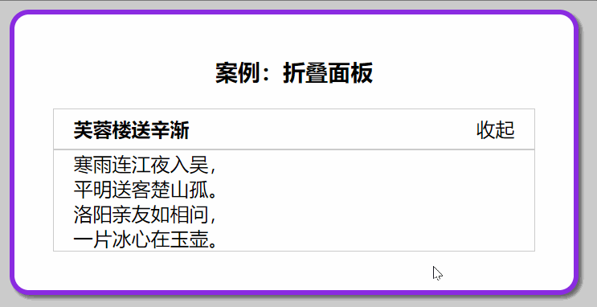
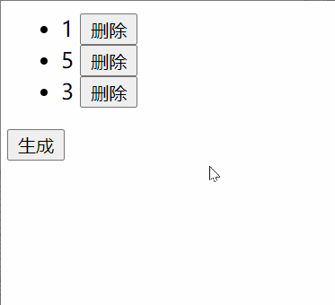
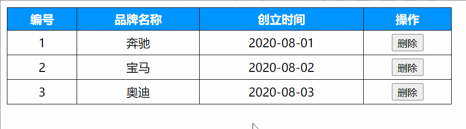

# vue基础

## Day01

### 作业

#### 1.翻转世界

> 目标: 点击按钮 - 把文字取反显示 - 再点击取反显示(回来了)

> 提示: 把字符串取反赋予回去

效果演示:


> 总结: 记住方法特点, 多做需求, vue是数据变化视图自动更新, 减少操作DOM时间, 提高开发效率


#### 2.折叠面板

> 目标: 点击展开或收起时，把内容区域显示或者隐藏



基础代码

```vue
<!DOCTYPE html>
<html lang="en">

<head>
  <meta charset="UTF-8">
  <meta http-equiv="X-UA-Compatible" content="IE=edge">
  <meta name="viewport" content="width=device-width, initial-scale=1.0">
  <title>Document</title>
  <style>
    body {
      background-color: #ccc;
    }

    #app {
      width: 400px;
      margin: 20px auto;
      background-color: #fff;
      border: 4px solid blueviolet;
      border-radius: 1em;
      box-shadow: 3px 3px 3px rgba(0, 0, 0, 0.5);
      padding: 1em 2em 2em;
    }

    #app h3 {
      text-align: center;
    }

    .title {
      display: flex;
      justify-content: space-between;
      align-items: center;
      border: 1px solid #ccc;
      padding: 0 1em;
    }

    .title h4 {
      line-height: 2;
      margin: 0;
    }

    .container {
      border: 1px solid #ccc;
      padding: 0 1em;
    }

    .btn {
      /* 鼠标改成手的形状 */
      cursor: pointer;
    }
  </style>
</head>

<body>
  <div id="app">
    <h3>案例：折叠面板</h3>
    <div>
      <div class="title">
        <h4>芙蓉楼送辛渐</h4>
        <span class="btn">
          收起
        </span>
      </div>
      <div class="container">
        <p>寒雨连江夜入吴,</p>
        <p>平明送客楚山孤。</p>
        <p>洛阳亲友如相问，</p>
        <p>一片冰心在玉壶。</p>
      </div>
    </div>
  </div>
  <script src="./vue.js"></script>
  <script>
    const app = new Vue({
      el: '#app'
    })
  </script>

</body>

</html>
```


### 附加练习

#### 1.帅哥美女走一走

> 目标: 点击按钮, 改变3个li的顺序, 在头上的就到末尾.

> 提示: 操作数组里的顺序, v-for就会重新渲染li


#### 2.加加减减

> 目标: 点击生成按钮, 新增一个li(20以内的随机数字)和删除按钮, 点击删除按钮, 删除对应的li和值

> 提示: 数组渲染列表, 生成和删除都围绕数组操作



#### 3.购物车

> 目标: 完成商品浏览和删除功能, 当无数据给用户提示

* 需求1: 根据给的初始数据, 把购物车页面铺设出来
* 需求2: 点击对应删除按钮, 删除对应数据
* 需求3: 当数据没有了, 显示一条提示消息



html+css和数据代码结构(可复制接着写)

```vue
<!DOCTYPE html>
<html lang="en">

<head>
  <meta charset="UTF-8">
  <meta http-equiv="X-UA-Compatible" content="IE=edge">
  <meta name="viewport" content="width=device-width, initial-scale=1.0">
  <title>Document</title>
  <style>
    #app {
      width: 600px;
      margin: 10px auto;
    }

    .tb {
      border-collapse: collapse;
      width: 100%;
    }

    .tb th {
      background-color: #0094ff;
      color: white;
    }

    .tb td,
    .tb th {
      padding: 5px;
      border: 1px solid black;
      text-align: center;
    }

    .add {
      padding: 5px;
      border: 1px solid black;
      margin-bottom: 10px;
    }
  </style>
</head>

<body>
  <div id="app">
    <table class="tb">
      <tr>
        <th>编号</th>
        <th>品牌名称</th>
        <th>创立时间</th>
        <th>操作</th>
      </tr>
      <!-- 循环渲染的元素tr -->
      <tr>
        <td>1</td>
        <td>车名</td>
        <td>2020-08-09</td>
        <td>
          <button>删除</button>
        </td>
      </tr>
      <tr>
        <td colspan="4">没有数据咯~</td>
      </tr>
    </table>
  </div>
  <script src="./vue.js"></script>
  <script>
    const app = new Vue({
      el: '#app',
      data: {
        list: [
          { id: 1, name: "奔驰", time: "2020-08-01" },
          { id: 2, name: "宝马", time: "2020-08-02" },
          { id: 3, name: "奥迪", time: "2020-08-03" },
        ]
      }
    })
  </script>

</body>

</html>
```


## Day02

### 作业

#### 1.逛水果店


只要你实现了功能 你就是对的 (只不过每个程序员的想法都不太一样)

#### 2.选择喜欢的

目标: 用户选择栏目, 把用户选中的栏目信息在下面列表显示出来

> 提示: vue变量是数组类型, 绑定在checkbox标签上

```js
// 数据在这里
["科幻", "喜剧", "动漫", "冒险", "科技", "军事", "娱乐", "奇闻"]
```


#### 3.案例-全选和反选

> 目标: 完成全选和反选的功能

注意: 小选框都选中(手选/点反选), 全选自动选中

图示:


标签和数据准备(可复制):

```vue
<!DOCTYPE html>
<html lang="en">

<head>
  <meta charset="UTF-8">
  <meta http-equiv="X-UA-Compatible" content="IE=edge">
  <meta name="viewport" content="width=device-width, initial-scale=1.0">
  <title>Document</title>
</head>

<body>
  <div id="app">
    <div>
      <span>全选:</span>
      <input type="checkbox" />
      <button>反选</button>
      <ul>
        <li>
          <input type="checkbox" />
          <span>名字</span>
        </li>
      </ul>
    </div>
  </div>
  <script src="./vue.js"></script>
  <script>
    const app = new Vue({
      el: '#app',
      data: {
        arr: [
          {
            name: "猪八戒",
            checked: false,
          },
          {
            name: "孙悟空",
            checked: false,
          },
          {
            name: "唐僧",
            checked: false,
          },
          {
            name: "白龙马",
            checked: false,
          },
        ],
      }
    })
  </script>


</body>

</html>
```

### 附加练习


#### 1. 品牌管理

> 目标: 数据铺设, 数据新增, 数据删除

- 需求1: 把默认数据显示到表格上 
- 需求2: 注意资产超过100的, 都用红色字体标记出来
- 需求3: 点击删除的a标签, 删除数据
- 需求4: 实现底部添加资产的功能
- 需求5: 完成总价和均价
- 需求6: 侦听list变化, 同步到浏览器本地

细节:

- 注意a标签有默认行为-跳转刷新页面(如果有href属性)
- 添加资产时, 提示用户数据不能为空
- form表单里的button的点击事件, 会触发默认表单提交的行为

图示:

(总价和均价)

> 目标: 基于之前的案例, 完成总价和均价的计算效果


```vue
<!DOCTYPE html>
<html lang="en">

<head>
  <meta charset="UTF-8">
  <meta http-equiv="X-UA-Compatible" content="IE=edge">
  <meta name="viewport" content="width=device-width, initial-scale=1.0">
  <title>Document</title>
  <link rel="stylesheet" href="	https://cdn.jsdelivr.net/npm/bootstrap@5.3.0-alpha1/dist/css/bootstrap.min.css">
  <style>
    .red {
      color: red;
    }
  </style>
</head>

<body>
  <div id="app">
    <div class="container">
      <!-- 顶部搜索框模块 -->
      <div class="form-group">
        <div class="input-group">
          <h4>品牌管理</h4>
        </div>
      </div>

      <!-- 数据表格 -->
      <table class="table table-bordered table-hover mt-2">
        <thead>
          <tr>
            <th>编号</th>
            <th>资产名称</th>
            <th>价格</th>
            <th>创建时间</th>
            <th>操作</th>
          </tr>
        </thead>
        <tbody>
          <tr>
            <td></td>
            <td></td>

            <!-- 如果价格超过100，就有red这个类 -->
            <td class="red"></td>
            <td></td>
            <td><a href="#">删除</a></td>
          </tr>
          <tr style="background-color: #EEE">
              <td>统计:</td>
              <td colspan="2">总价钱为: 100</td>
              <td colspan="2">平均价: 100</td>
        </tr>
        </tbody>
        <tfoot>
          <tr>
            <td colspan="5" style="text-align: center">暂无数据</td>
          </tr>
        </tfoot>
      </table>

      <!-- 添加资产 -->
      <form class="form-inline">
        <div class="form-group">
          <div class="input-group">
            <input type="text" class="form-control" placeholder="资产名称" />
          </div>
        </div>
        &nbsp;&nbsp;&nbsp;&nbsp;
        <div class="form-group">
          <div class="input-group">
            <input type="text" class="form-control" placeholder="价格" />
          </div>
        </div>
        &nbsp;&nbsp;&nbsp;&nbsp;
        <!-- 阻止表单提交 -->
        <button class="btn btn-primary">添加资产</button>
      </form>
    </div>
  </div>
  <script src="./vue.js"></script>
  <script>
    const app = new Vue({
      el: '#app',
      data: {
        name: "", // 名称
        price: 0, // 价格
        list: [
          { id: 100, name: "外套", price: 199, time: new Date('2010-08-12') },
          { id: 101, name: "裤子", price: 34, time: new Date('2013-09-01') },
          { id: 102, name: "鞋", price: 25.4, time: new Date('2018-11-22') },
          { id: 103, name: "头发", price: 19900, time: new Date('2020-12-12') }
        ],
      }
    })
  </script>


</body>

</html>
```

#### 2.买点书练习

> 目标: 把数据铺设到页面上, 当用户点击买书按钮, 书籍数量增加1, 并且要计算累计的和

演示:


标签结构和数据(复制接着写): 

```vue
<!DOCTYPE html>
<html lang="en">

<head>
  <meta charset="UTF-8">
  <meta http-equiv="X-UA-Compatible" content="IE=edge">
  <meta name="viewport" content="width=device-width, initial-scale=1.0">
  <title>Document</title>
</head>

<body>
  <div id="app">
    <div>
      <p>请选择你要购买的书籍</p>
      <ul>
      </ul>
      <table border="1" width="500" cellspacing="0">
        <tr>
          <th>序号</th>
          <th>书名</th>
          <th>单价</th>
          <th>数量</th>
          <th>合计</th>
        </tr>
      </table>
      <p>总价格为: </p>
    </div>
  </div>
  <script src="./vue.js"></script>
  <script>
    const app = new Vue({
      el: '#app',
      data: {
        arr: [
        {
          name: "水浒传",
          price: 107,
          count: 0,
        },
        {
          name: "西游记",
          price: 192,
          count: 0,
        },
        {
          name: "三国演义",
          price: 219,
          count: 0,
        },
        {
          name: "红楼梦",
          price: 178,
          count: 0,
        },
      ],
      }
    })
  </script>
</body>

</html>
```

### 附加练习2 

#### 1.选你爱我求和

> 目标: 把用户选中的数字, 累计求和显示

提示: 

- v-model绑定的变量是数组, 可以收集checkbox的value属性呦

演示:


准备代码:

```vue
<!DOCTYPE html>
<html lang="en">

<head>
  <meta charset="UTF-8">
  <meta http-equiv="X-UA-Compatible" content="IE=edge">
  <meta name="viewport" content="width=device-width, initial-scale=1.0">
  <title>Document</title>
</head>

<body>
  <div id="app">
    <div>
      <div
        style="display: inline-block"
      >
        <input type="checkbox"  />
        <span>1</span>
      </div>
      <p>你选中的元素, 累加的值和为: xxx</p>
    </div>
  </div>
  <script src="./vue.js"></script>
  <script>
    const app = new Vue({
      el: '#app',
      data: {
        arr: [9, 15, 19, 25, 29, 31, 48, 57, 62, 79, 87],
      }
    })
  </script>
</body>

</html>
```


#### 2. 移动端-导航切换效果

目标: 切换到移动端画面, 点击导航, 高亮

> 提示: 索引 / 高亮的class样式

图例:


```html
<!DOCTYPE html>
<html lang="en">

<head>
  <meta charset="UTF-8">
  <meta http-equiv="X-UA-Compatible" content="IE=edge">
  <meta name="viewport" content="width=device-width, initial-scale=1.0">
  <title>Document</title>
  <style>
    .wrap {
      width: 100%;
      display: flex;
      margin: 0.2rem 0 0 0;
      position: relative;
    }

    /*左侧的导航样式*/
    .nav_left {
      width: 21.1875rem;
      overflow: scroll;
    }

    .nav_left::-webkit-scrollbar {
      display: none;
    }

    .nav_content {
      white-space: nowrap;
      padding: 0 0.7rem;
    }

    .nav_content span {
      display: inline-block;
      padding: 0.4rem 0.6rem;
      font-size: 0.875rem;
    }

    .nav_content .active {
      border-bottom: 2px solid #7f4395;
      color: #7f4395;
    }

    .nav_left,
    .down {
      float: left;
    }
  </style>
</head>

<body>
  <div id="app">
    <div class="wrap">
      <div class="nav_left" id="navLeft">
        <div class="nav_content">
          <span class="active">导航名字</span>
        </div>
      </div>
    </div>
  </div>
  <script src="./vue.js"></script>
  <script>
    const app = new Vue({
      el: '#app',
      data: {
        arr: [
          {
            first_id: "0",
            first_name: "热门"
          },
          {
            first_id: "621",
            first_name: "\u5496\u5561",
          },
          {
            first_id: "627",
            first_name: "\u996e\u98df",
          },
          {
            first_id: "279",
            first_name: "\u7537\u88c5",
          },
          {
            first_id: "294",
            first_name: "\u5973\u88c5",
          },
          {
            first_id: "122",
            first_name: "\u773c\u955c",
          },
          {
            first_id: "339",
            first_name: "\u5185\u8863\u914d\u9970",
          },
          {
            first_id: "391",
            first_name: "\u6bcd\u5a74",
          },
          {
            first_id: "35",
            first_name: "\u978b\u9774",
          },
          {
            first_id: "39",
            first_name: "\u8fd0\u52a8",
          },
          {
            first_id: "153",
            first_name: "\u7bb1\u5305",
          },
          {
            first_id: "119",
            first_name: "\u7f8e\u5986\u4e2a\u62a4",
          },
          {
            first_id: "355",
            first_name: "\u5bb6\u7eba",
          },
          {
            first_id: "51",
            first_name: "\u9910\u53a8",
          },
          {
            first_id: "334",
            first_name: "\u7535\u5668",
          },
          {
            first_id: "369",
            first_name: "\u5bb6\u88c5",
          },
          {
            first_id: "10",
            first_name: "\u5bb6\u5177",
          },
          {
            first_id: "223",
            first_name: "\u6570\u7801",
          },
          {
            first_id: "429",
            first_name: "\u6c7d\u914d",
          },
          {
            first_id: "546",
            first_name: "\u5065\u5eb7\u4fdd\u5065",
          },
          {
            first_id: "433",
            first_name: "\u5b9a\u5236",
          },
        ]
      }
    })
  </script>
</body>

</html>
```

#### 3.学生信息管理

==如果1个按钮不会写, 用2个按钮写==

目标: 

- 需求1: 铺设页面, 准备初始的数据(自己手写数据结构) - 前面是数组索引+1 *作为序号
- 需求2: 当输入框没有值, 要给用户一个提示, 必须都有值才能增加新数据 (数据驱动页面哦)
- 需求3: 添加功能 - 想好数据结构统一对象的key
- 需求4: 点击编辑功能, 把值赋予到输入框上(不要操作dom, 数据驱动页面)
- 需求5: 用户修改后, 点击相同按钮 - 想想怎么判断怎么是添加还是修改的功能 (提示: 准备一个全局变量, 点过编辑按钮可以让它为true) - 实现编辑后更新页面效果
- 需求6: 点击删除, 删除这行数据


不带vue代码的标签结构

```vue
<!DOCTYPE html>
<html lang="en">

<head>
  <meta charset="UTF-8">
  <meta http-equiv="X-UA-Compatible" content="IE=edge">
  <meta name="viewport" content="width=device-width, initial-scale=1.0">
  <title>Document</title>
</head>

<body>
  <div id="app">
      <div>
        <span>姓名:</span>
        <input type="text" />
      </div>
      <div>
        <span>年龄:</span>
        <input type="number" />
      </div>
      <div>
        <span>性别:</span>
        <select>
          <option value="男">男</option>
          <option value="女">女</option>
        </select>
      </div>
      <div>
        <button>添加/修改</button>
      </div>
      <div>
        <table border="1" cellpadding="10" cellspacing="0">
          <tr>
            <th>序号</th>
            <th>姓名</th>
            <th>年龄</th>
            <th>性别</th>
            <th>操作</th>
          </tr>
          <tr>
            <td></td>
            <td></td>
            <td></td>
            <td></td>
            <td>
              <button>删除</button>
              <button>编辑</button>
            </td>
          </tr>
        </table>
      </div>
  </div>
  <script src="./vue.js"></script>
  <script>
    const app = new Vue({
      el: '#app',
      data: {
       
      }
    })
  </script>
</body>

</html>
```


## Day03

### 作业

#### 1. 智慧商城首页渲染

目标：完成智慧商城首页渲染

**相关素材：见《素材》目录下的 - 《day03-智慧商城-首页渲染》**

需求拆分：

1. Vue中发送请求，获取数据

2. 存储导航数据，渲染导航

   

3. 存储商品数据，渲染商品

   

4. 存储轮播数据，渲染轮播，轮播图初始化 （思考：轮播图swiper初始化需要在哪里初始化）


#### 2. 组件注册巩固

需求：将购物车页面组件进行拆分

需求拆解：

1. 脚手架新建项目，保留 App.vue 和 main.js，将App.vue 结构进行替换
2. CartItem 组件拆分注册使用 （只拆结构）
3. NumberBox 组件拆分注册使用（只拆结构）


App.vue 准备代码（直接复制替换原来的 App.vue 代码即可）

```vue
<template>
  <div class="wrap clearfix">
    <div class="location">当前位置：首页 <span>&nbsp;&gt;&nbsp;</span><b class="red"> 购物车</b></div>
    <table width="100%" class="cartTable" cellspacing="0" cellpadding="10px">
      <!-- 首行 -->
      <tr class="title">
        <td width="50"><input type="checkbox" name="" class="choose_all"></td>
        <td width="100" class=""><span style="margin-left: -10px;">全选</span></td>
        <td width="400">商品信息</td>
        <td width="150">单价（元）</td>
        <td width="150">数量</td>
        <td width="150">金额（元）</td>
        <td width="80">操作</td>
      </tr>

      <!-- 商品 -->
      <tr class="row" >
        <td><input type="checkbox" name="" class="choose"></td>
        <td class="tal"><a href="#" class="pic"></a>
        </td>
        <td class="tal"><a href="#">艾美特(Airmate) 电风扇 五叶大风量4档遥控控制家用电扇空调伴侣 FS4056R-5</a></td>
        <td>
          <del class="tdl">158.00</del>
          <br>
          <b class="unit">129.00</b>
        </td>
        <td>
          <!-- 数字框 -->
          <div class="amount">
            <a href="#" class="Increase">+</a>
            <input type="text" value="1" class="unum">
            <a href="#" class="Reduce">-</a>
          </div>
        </td>
        <td><b class="u-price">129.00</b></td>
        <td><a href="#" class="btn-del">删除</a></td>
      </tr>

      <tr class="row" >
        <td><input type="checkbox" name="" class="choose"></td>
        <td class="tal"><a href="#" class="pic"></a>
        </td>
        <td class="tal"><a href="#">艾美特(Airmate) 电风扇 五叶大风量4档遥控控制家用电扇空调伴侣 FS4056R-5</a></td>
        <td>
          <del class="tdl">158.00</del>
          <br>
          <b class="unit">129.00</b>
        </td>
        <td>
          <div class="amount">
            <a href="#" class="Increase">+</a>
            <input type="text" value="1" class="unum">
            <a href="#" class="Reduce">-</a>
          </div>
        </td>
        <td><b class="u-price">129.00</b></td>
        <td><a href="#" class="btn-del">删除</a></td>
      </tr>

      <tr class="row" >
        <td><input type="checkbox" name="" class="choose"></td>
        <td class="tal"><a href="#" class="pic"></a>
        </td>
        <td class="tal"><a href="#">艾美特(Airmate) 电风扇 五叶大风量4档遥控控制家用电扇空调伴侣 FS4056R-5</a></td>
        <td>
          <del class="tdl">158.00</del>
          <br>
          <b class="unit">129.00</b>
        </td>
        <td>
          <div class="amount">
            <a href="#" class="Increase">+</a>
            <input type="text" value="1" class="unum">
            <a href="#" class="Reduce">-</a>
          </div>
        </td>
        <td><b class="u-price">129.00</b></td>
        <td><a href="#" class="btn-del">删除</a></td>
      </tr>

      <tr class="count">
        <td colspan="7">
          <div class="jiesuan clearfix">
            <div class="left fl">
              <p><input type="checkbox" name="" class="choose_all"> 全选&nbsp;&nbsp;&nbsp;<a href="#" class="del_check">删除选中商品</a></p>
            </div>
            <div class="right fr clearfix">
              <p>商品总计：￥465.00</p>
              <p>活动优惠：-￥0.00</p>
              <p>已选商品<span class="red t-number"> 0 </span>件 总价(不含运费、税费)：<span class="red t-price">￥0.00</span></p>
              <!-- <div><a href="#" class="btn pay">结算</a></div> -->
              <a href="#" class="btn pay fr">结算</a>
            </div>
          </div>
        </td>
      </tr>
    </table>
  </div>
</template>

<script>
export default {

}
</script>

<style>
/* 公共样式 */
.clearfix {
  content: '';
  display: block;
  clear: both;
}

.red {
  color: #f30213;
}

.fl {
  float: left;
}

.fr {
  float: right;
}

/* 清除默认样式 */
* {
  margin: 0px;
  padding: 0px;
  font-size: 14px;
}

a {
  text-decoration: none;
  color: #333;
}

table {
  padding: 10px;
}

input {
  outline: none;
}

.wrap {
  width: 1180px;
  margin: 0 auto;
}

.wrap .location {
  padding: 10px 0;
  border-bottom: 1px solid #ccc;
  margin-bottom: 20px;
}

.title {
  height: 40px;
  line-height: 40px;
}

.cartTable {
  border: 1px solid #ccc;

}

.cartTable tr.title {
  background-color: rgb(241, 243, 244);
  font-weight: bold;
}

.cartTable tbody tr td {
  /* border: 1px solid rgb(245, 245, 245); */
  padding: 10px;
}

/* 原价 */
.cartTable tbody tr td .tdl {
  text-decoration: line-through;
  color: #999;
}

/* 商品数量 */
.cartTable tr .amount .unum {
  width: 70px;
  height: 30px;
  box-sizing: border-box;
  text-align: center;
  font-size: 16px;
  float: left;
}

/* 数量加减按钮 */
.cartTable tr .amount a {
  display: block;
  width: 30px;
  height: 30px;
  line-height: 30px;
  text-align: center;
  font-size: 18px;
  border: 1px solid #ccc;
  box-sizing: border-box;
}

.cartTable tr .amount a.Increase {
  border-right: none;
  float: left;
}

.cartTable tr .amount a.Reduce {
  border-left: none;
  float: left;
}

.cartTable tr.count .jiesuan .right {
  text-align: right;

}

.cartTable tr.count .jiesuan .right p {
  margin: 5px 0;
}

.cartTable tr.count .jiesuan .right .pay {
  display: block;
  width: 160px;
  height: 50px;
  line-height: 50px;
  background-color: #f30213;
  color: #fff;
  font-weight: bold;
  text-align: center;
  font-size: 20px;
}

.row img {
  width: 100px;
  height: 100px;
}
</style>
```


### 附加练习

#### 1. 医疗诊断系统-BMI测试

**题干**

实现一个医疗诊断系统，包括一个表单用来收集患者的基本信息，包括姓名、年龄、身高、体重、病史等信息。

1. 利用脚手架创建项目
2. 在表单中使用 v-model 指令来绑定输入框的数据到 Vue 实例的数据。
3. 当提交表单时触发诊断函数，在诊断函数中，根据患者的信息计算出 Body Mass Index (BMI)，并判断该患者是否健康。
4. 显示诊断结果（健康/不健康）。


注意：

BMI（身体质量指数）的计算公式是将一个人的体重除以他们身高的平方。BMI的计算公式如下：

- BMI = 体重（kg）/ 身高（m）^2

请注意，BMI只是一个人体脂肪的粗略估计，不应作为整体健康的唯一衡量标准。

- BMI <= 18.5  体重过轻
- 18.5 < BMI <= 24.9  正常
- 24.9 < BMI <= 29.9  体重过重
- BMI > 29.9  肥胖

提示：

- 脚手架环境下的 data 是一个函数，在函数中 return 

```jsx
export default {
    data () {
    	return {
        	msg: 'zs'
    	}
	},
    methods: {
    	...
	}
}
```


## Day04

### 作业

#### 医疗系统-就诊记录

用于展示患者的就诊记录。每一条就诊记录需要展示就诊日期、医生姓名、诊断结果和处方信息。用户可以通过输入关键字进行搜索，搜索结果将实时展示在表格中。点击详情可以弹出一个弹窗组件，展示基本信息。


需求：

1. 实现搜索框根据关键词 查询出对应的数据
2. 封装一个表格组件，组件里边人记录，根据父组件传递过来的数组展示
3. 封装一个详情组件
4. 点击详情的时候，可以打开弹窗组件，并且展示用户的信息
5. 点击X关闭弹窗 组件

列表静态页面 ==> 可直接复制

```jsx
<template>
  <div>
    <input placeholder="输入关键字搜索">
    <table class="my-table">
      <thead>
        <tr>
          <th>就诊日期</th>
          <th>医生姓名</th>
          <th>诊断结果</th>
          <th>处方信息</th>
          <th>操作</th>
        </tr>
      </thead>
      <tbody>
        <tr >
          <td>2020-12-12</td>
          <td>章三</td>
          <td>李四</td>
          <td>健康</td>
          <td>详情</td>
        </tr>
      </tbody>
    </table>
  </div>
</template>

<style scoped>
  .my-table {
    border-collapse: collapse;
    width: 100%;
  }

  .my-table td, .my-table th {
    border: 1px solid #ddd;
    padding: 8px;
    text-align: left;
  }

  .my-table th {
    background-color: #f2f2f2;
  }
</style>

```

详情静态页面 ==> 可直接复制 

```jsx
 <template>
  <div class="modal-mask">
    <div class="modal-container">
      <div class="modal-header">
        <h3>就诊记录详情</h3>
        <span class="close-btn">X</span>
      </div>
      <div class="modal-body">
        <p><strong>就诊日期：</strong>章三</p>
        <p><strong>医生姓名：</strong>李四</p>
        <p><strong>诊断结果：</strong>健康</p>
        <p><strong>处方信息：</strong>无</p>
      </div>
    </div>
  </div>
</template>

<style scoped>
.hidden{
  display: none !important;
}
.modal-mask {
  position: fixed;
  top: 0;
  left: 0;
  bottom: 0;
  right: 0;
  background-color: rgba(0, 0, 0, 0.5);
  display: flex;
  justify-content: center;
  align-items: center;
}

.modal-container {
  background-color: #fff;
  border-radius: 5px;
  padding: 20px;
  max-width: 500px;
}

.modal-header {
  display: flex;
  justify-content: space-between;
  align-items: center;
}

.close-btn {
  cursor: pointer;
}
</style>

```

数据参考

```jsx
records: [
  {
    date: '2022-01-01',
    doctor: '张三',
    diagnosis: '感冒',
    prescription: '感冒药',
  },
  {
    date: '2022-02-01',
    doctor: '李四',
    diagnosis: '头疼',
    prescription: '止疼药',
  },
  {
    date: '2022-03-01',
    doctor: '王五',
    diagnosis: '腰痛',
    prescription: '止痛贴',
  }
]
```


### 附加练习

#### 数学题

**目标:** 随机产生 5道 数学题, 输入答案提交后, 在下面对应序号显示结果

说明：

1. 随机指的是两个加法数字随机
2. 点击提交后，下面【对应序号】中需要展示结果
   - 未完成
   - 回答正确
   - 回答错误


准备代码:

SubjectItem.vue - 题目一行组件

```jsx
<template>
  <div class="subject">
    <span></span>
    <span>+</span>
    <span></span>
    <span>=</span>
    <input type="number" />
    <button>提交</button>
  </div>
</template>

<script>
export default {

};
</script>

<style scoped>
.subject {
  margin: 5px;
  padding: 5px;
  font-size: 20px;
}
.subject span {
  display: inline-block;
  text-align: center;
  width: 20px;
}
.subject input {
  width: 50px;
  height: 20px;
}
</style>
```

FlagItem.vue - 下面结果一条的组件

```jsx
<template>
  <span >1: 未完成</span>
</template>

<script>
export default {

};
</script>

<style scoped>
.right {
  color: green;
}
.error {
  color: red;
}
.undo {
  color: #ccc;
}
</style>
```

App.vue

```jsx
<template>
  <div id="app">
    <h2>测试题</h2>
    <subject ></subject>
    <div>
      <flag></flag>
    </div>
  </div>
</template>

<script>

export default {
  
};
</script>

<style>
body {
  background-color: #eee;
}

#app {
  background-color: #fff;
  width: 500px;
  margin: 50px auto;
  box-shadow: 3px 3px 3px rgba(0, 0, 0, 0.5);
  padding: 2em;
}
</style>
```


## Day05

### 作业

#### 插槽练习

要点：利用插槽实现下述效果，同一个组件实现不同的两个效果


### 附加练习

#### 用户订单的物流信息

你正在为一家电商网站开发一个物流信息追踪组件，该组件可以显示用户订单的物流信息，
包括当前物流状态、物流公司名称、物流单号等。要求组件支持以下功能：

1. 通过传入订单号，向后端请求该订单的物流信息 ==> 现阶段可以利用 定时器模拟后端返回数据
2. 查询结果可以由拆分成两个组件==> 1. 商品组件 2. 物流组件
3. 商品组件 ==> 商品描述这一块 要求可以支持自定义 ==> 插槽
4. 物流组件 ==> 当前物流是的状态是由字段：`logisticsStatus: 2, // 0 未发货 1 已发货 2 已签收 3 未签收`  ==> 做到不同的状态  颜色是不一样的
5. 物流组件里的查看详情按钮  ==> 不是所有人都可以点击，只要 `admin``zhangsan``lisi`可以查看 ===> 通过自定义指令，实现一个简单的权限判断。


准备好的数据：

```jsx
orderInfo = {
  orderNo: this.currentOrderNo,
  role: 'admin', // 角色 ==> 用于判断是否有查看用户详情的权限
  logisticsStatus: 2, // 0 未发货 1 已发货 2 已签收 3 未签收
  logisticsCompany: '顺丰速运', // 快递公司的名称
  logisticsNo: 'SF123456789', // 快件运单号
  logisticsInfo: [
    {
      time: '2023-02-01 10:00:00', // 时间
      content: '快件已发货' // 快递状态
    },
    {
      time: '2023-02-02 09:00:00',
      content: '快件到达深圳中心'
    },
    {
      time: '2023-02-03 08:00:00',
      content: '快件派送中'
    },
    {
      time: '2023-02-04 16:00:00',
      content: '已签收'
    }
  ],
  goodInfo: { // 商品信息
    goodNo: '12345678912312', // 商品id
    goodName: '三体',// 商品名称
    type: 0, // 0 代表的是文本 1代表的是 图片
    // desc 描述 ==> 可以是图片 也可以是其他的东西。数据可以随便改
    desc: '	http://registakeaway.itheima.net/common/download?name=9b978122-179a-4b0e-891b-595d0cd3d875.jpg'
  }
}
```

基本结构 ==> 直接复制 ==> 在这个基础上修改

```jsx
<template>
  <div>
    <div>
      <label for="orderNo">订单号：</label>
      <input id="orderNo" />
      <button>查询</button>
    </div>
    <div class="logistics-info">
      <h2>商品相关信息</h2>
      <div>
        <div>商品id: <strong>SF12345678912312</strong></div>
        <div>商品名称: <strong>三体</strong></div>
        <div>商品描述: <slot name="desc">这是一本好书</slot></div>
      </div>
      <h2>物流相关信息</h2>
      <div class="logistics-info-header">
        <div class="logistics-info-header-left">
          <div class="logistics-status blue">未发货</div>
          <div class="logistics-company">顺丰速运</div>
          <div class="logistics-no">SF123456789</div>
        </div>
      </div>
      <ul class="logistics-info-list">
        <li>
          <div class="logistics-info-list-time">2023-02-03 00:00:00</div>
          <div class="logistics-info-list-content">快件已经发货</div>
        </li>
      </ul>
      <button>查看物流详情</button>
    </div>
  </div>
</template>

<script>

</script>
<style scoped>
  .logistics-info {
    border: 1px solid #ccc;
    border-radius: 5px;
    box-shadow: 0px 0px 10px #eee;
    padding: 10px;
    font-size: 14px;
  }

  .logistics-info-header {
    display: flex;
    justify-content: space-between;
    align-items: center;
    margin-bottom: 10px;
  }

  .logistics-info-header-left {
    display: flex;
    align-items: center;
  }

  .logistics-status {
    font-weight: bold;
    font-size: 16px;
    color: #007bff;
  }

  .logistics-company,
  .logistics-no {
    margin-left: 10px;
    font-size: 14px;
    color: #333;
  }

  .logistics-info-list {
    list-style: none;
    padding: 0;
    margin: 0;
    max-height: 230px;
    overflow-y: auto;
  }

  .logistics-info-list li {
    display: flex;
    margin-bottom: 10px;
  }

  .logistics-info-list-time {
    font-size: 12px;
    color: #999;
    width: 80px;
    text-align: right;
    margin-right: 10px;
  }

  .logistics-info-list-content {
    font-size: 14px;
    color: #333;
  }
</style>
```


## Day06

### 作业

#### 好客租房路由配置

需求：

- 搭建好客租房项目的路由 ==> 首页   找房   资讯   我的   详情

- - 对样式无要求
  - 找房页面实现 列表展示即可，其他页面内容无所谓， 但是列表页 点击要可以跳到详情页

- 实现找房页面 列表数据的展示

演示效果：[http://www.xiaoshuaipeng.com:3000](http://www.xiaoshuaipeng.com:3000)

后台接口地址：[http://www.xiaoshuaipeng.com:8080](http://www.xiaoshuaipeng.com:8080/)


